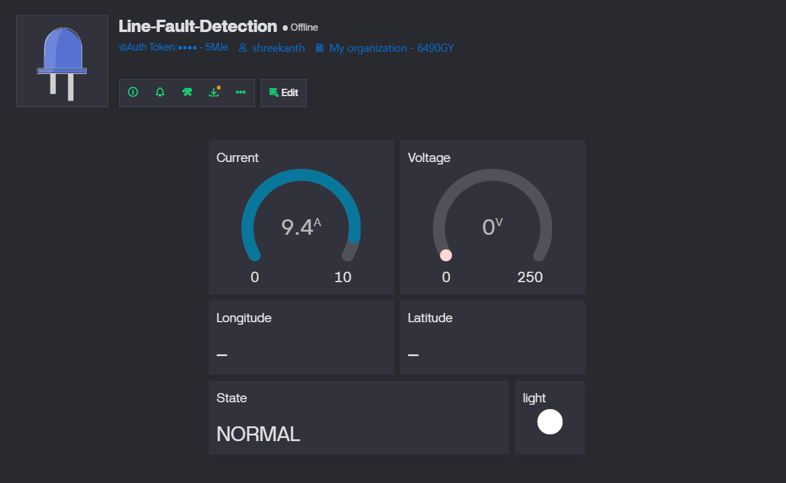

# ⚡ Line Fault Detection System using ESP32, IoT, GPS & Blynk

## 📌 Overview

This project implements an IoT-based **Line Fault Detection and Monitoring System** using ESP32.

It continuously monitors electrical parameters and environmental conditions to detect faults and enables real-time remote control and monitoring using Blynk.

---

## 🚀 Features

* ⚡ Real-time voltage, current, and power monitoring (INA219)
* 📍 GPS-based fault location tracking
* 🌗 LDR-based light/dark detection
* 🔌 Relay-based line control (trip/restore)
* 📱 Remote monitoring via Blynk IoT
* 🔁 Auto and Manual operating modes

---

## 🧰 Hardware Components

* ESP32 Dev Module
* INA219 Current Sensor
* NEO-6M GPS Module
* 5V Relay Module (Active LOW)
* LDR Digital Sensor Module

---

## 🔌 Pin Configuration

| Component  | ESP32 Pin |
| ---------- | --------- |
| GPS TX     | GPIO16    |
| GPS RX     | GPIO17    |
| INA219 SDA | GPIO21    |
| INA219 SCL | GPIO22    |
| Relay IN   | GPIO26    |
| LDR DO     | GPIO32    |

---

## ⚙️ Getting Started

### 1. Clone Repository

```
git clone https://github.com/<your-username>/line-fault-detection-esp32.git
cd line-fault-detection-esp32
```

### 2. Open with PlatformIO

* Open project in **VS Code**
* Install PlatformIO extension

### 3. Configure Credentials

Edit:

```
include/config.h
```

Add:

```cpp
#define BLYNK_TEMPLATE_ID "YOUR_TEMPLATE_ID"
#define BLYNK_DEVICE_NAME "Line Fault Detection"
#define BLYNK_AUTH_TOKEN "YOUR_AUTH_TOKEN"

#define WIFI_SSID "YOUR_WIFI"
#define WIFI_PASS "YOUR_PASSWORD"
```

### 4. Upload Code

```
pio run -t upload
```

### 5. Monitor Output

```
pio device monitor
```

---

## 📱 Blynk Setup

👉 [Blynk Setup Guide](docs/blynk_setup.md)

Includes:

* Datastream configuration
* Dashboard widgets
* GPS map integration
* Relay control setup
* Auto/Manual mode

---

## 📊 Blynk Dashboard

Below is the live monitoring dashboard used in this project:



### Features shown:

* Real-time Current and Voltage gauges
* Device state monitoring (NORMAL / Fault)
* LDR-based light detection indicator
* GPS coordinates (Latitude & Longitude)
* Clean IoT dashboard layout

---

## 🧠 Working Principle

* The system monitors voltage and current using INA219
* Abnormal conditions indicate a **line fault**
* GPS provides real-time fault location
* Relay isolates the faulty line
* Data is sent to Blynk for remote monitoring

---

## 📂 Project Structure

```
line-fault-detection-esp32/
│
├── include/
│   └── config.h
├── src/
│   └── main.cpp
├── docs/
│   ├── blynk_setup.md
│   └── blynk_dashboard.png
├── platformio.ini
└── README.md
```

---

## 🔮 Future Enhancements

* ⚠️ Fault classification (short circuit / overload / open line)
* 📡 GSM-based alert system
* 💾 Data logging (SD card / cloud)
* ⚙️ FreeRTOS-based multitasking
* 📊 Web dashboard (custom UI)

---

## 📜 License

MIT License

---

## ⭐ Contribution

Feel free to fork, improve, and submit pull requests.

---
